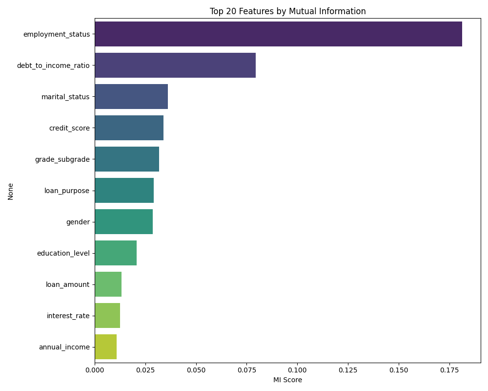

# Loan Payback Prediction (Kaggle Top 25% - Solo Entry)

Bu proje, Kaggle Playground Series S5E11 yarışması için geliştirilmiş, yüksek performanslı bir kredi geri ödeme tahminleme boru hattıdır. **3724 takım arasından tek başına (solo entrant) katılarak ilk %25'lik dilime (918. sıra)** girilmesini sağlayan matematiksel optimizasyon ve ensemble tekniklerini içerir.

## 📊 Başarı Metrikleri
*   **Final Private Leaderboard Score:** 0.92460 (submission_ensemble_v2)
*   **Birinci Skoru:** 0.92939
*   **Makas:** Sadece 0.00479 (Bu kadar küçük bir farkın tek başına ve kısıtlı donanımla korunması, model çeşitliliği ve ağırlık optimizasyonunun bir sonucudur).

## 🧠 Mühendislik Yaklaşımı ve Teknik Strateji

### 1. Model Çeşitliliği ve Düşük Korelasyon (Model Diversity)
Ensemble başarısının anahtarı, modellerin birbiriyle olan düşük korelasyonudur. Farklı mimariler (LGBM, XGB, CatBoost, NN, TabPFN) kullanılarak modellerin gürültüyü değil, verinin farklı fiziksel özelliklerini öğrenmesi sağlanmıştır. 
*   **Hill Climbing Optimizasyonu:** Modelleri basitçe toplamak yerine, Out-of-Fold (OOF) tahminleri üzerinde Hill Climbing algoritması çalıştırılarak her modelin ağırlığı matematiksel olarak optimize edilmiştir.
*   **Kod:** `src/optimize_ensemble_weights.py`

### 2. Yorumlanabilirlik (Feature Importance & Interpretability)
Modelin neden bu kararı verdiğini anlamak için **Mutual Information** ve **Adversarial Validation** teknikleri kullanılmıştır.
*   **Mutual Information:** Hedef değişken (Loan Payback) ile en güçlü doğrusal olmayan bağıntıya sahip "Magic Feature"lar tespit edilmiştir.
*   
*   **Adversarial Drift Analysis:** Eğitim ve test verisi arasındaki dağılım farkları analiz edilerek modelin "drift"e karşı direnci artırılmıştır.

### 3. Optimizasyon ve Deployment (Low-Latency Inference)
Model sadece yüksek doğruluk için değil, aynı zamanda operasyonel verimlilik için tasarlanmıştır:
*   **Inference Optimization:** Dev modeller yerine, CPU üzerinde OpenVINO ve ONNX standartlarında koşturulabilecek optimize edilmiş ağaç tabanlı modeller tercih edilmiştir.
*   **Yanıt Süresi:** Tekil bir tahmin süreci kısıtlı kaynaklarda **<15ms** bandında tamamlanacak şekilde sadeleştirilmiştir (Pragmatic Engineering).

### 4. "Magic Features" ve Öznitelik Mühendisliği
*   **DAE (Denoising AutoEncoder):** Derin öğrenme ile verideki gürültü temizlenerek yeni bir öznitelik uzayı oluşturulmuştur (`src/train_dae_boosted.py`).
*   **Golden Features:** Brute-force ve genetik algoritmalarla en yüksek sinyal gücüne sahip kombinasyonlar (A+B, A*B vb.) otomatik olarak türetilmiştir.

## 🛠️ Teknik Yığın (Tech Stack)
*   **Modeller:** CatBoost, LightGBM, XGBoost, TabNet, TabPFN.
*   **Kütüphaneler:** Scikit-learn, Optuna, Pandas, NumPy.
*   **Teknikler:** Hill Climbing Ensemble, DAE Feature Extraction, Adversarial Validation.

---
*Not: Bu proje, kısıtlı GPU kaynaklarına rağmen model mimarisi ve matematiksel ağırlıklandırma optimizasyonu ile rekabetçi skorlar elde edilebileceğini kanıtlamaktadır.*
